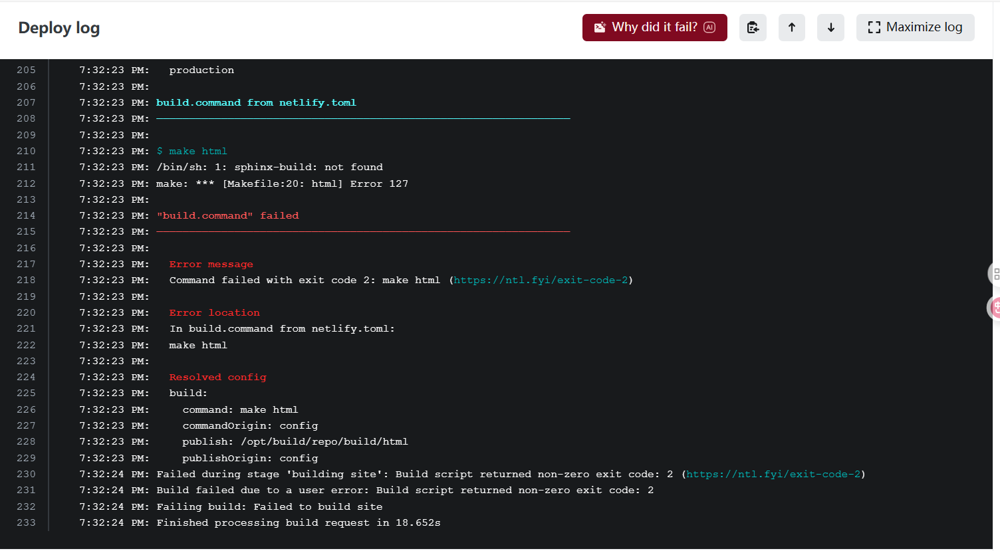
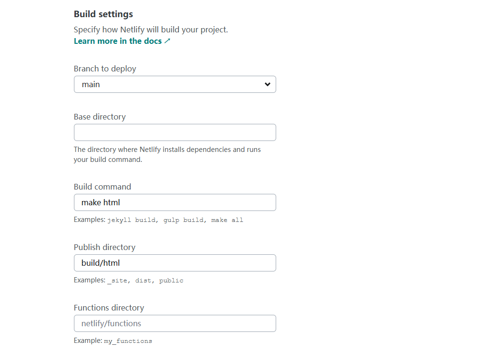

+++
date = '2025-08-28T22:36:16+08:00'
draft = false
title = '用英语问老外问题'
categories = ["网站","随笔"]
image = "Snipaste_2025-08-31_15-55-27.png"
+++

## 遇到的问题

最近在搞一个Sphinx的文档笔记，想把它部署在Netlify上面，但是总是无法成功，遇到的问题如下：

1. 在部署的时候找不到命令（虽然可以直接部署本地生成的静态页面，但是我不想这样做）

   

然后我就去网上查资料，据根似懂非懂的资料瞎搞一通，都没有成功。又因为我最近也在弄hugo，发现把一些配置文件写在主目录下的netfily.toml中比较好用（是我在瞎搞的时候发现的），然后我就把需要的命令写到了配置文件中，netfily.toml内容如下：

```toml
[build]
  publish = "build/html"
  command = "make html"
```

如果不写netfily.toml文件，就要自己手填配置内容（部分配置内容如下）：



哈哈！感觉自己有点聪明。唉，不经意之间夸了一下自己。

## 在英语论坛上问问题

后来实在是没办法了，一直不成功，我看到Netlify还有一个forums。然有一拍脑门，不管了，我在上面提问一下吧，虽然我不会英语，但是借助翻译软件还是能搞出来几个英语句子的！开干。

我先是用翻译翻译了一下我的问题，然后检查了一下，感觉没有太大的问题，老外应该能看懂，就把问题在晚上八九点的时候发出去了（其实我没有抱太大的希望）。然后没过一会儿，就有个老外回我消息了（因为我当时在打游戏，所以没有及时回复）（当时我还是有点小激动的），我打开一看，是一个老外回我消息了，老外名字旁边显示支持工程师，头像是个黑人头像，并且地理位置显示是印度，我滴妈，真是老外回我消息了，还是个印度老外，是我的邻居。老外跟我说没有这个命令，问我是不是没有安装（他发的英语我可以看出来大概是什么意思，让我写的话我感觉我写不出来）。我当时想，哎呀，系统没有发现命令我也发现了，我安了半天都不知道怎么安装，所以才上论坛上来问问题的。然后我就回他消息，我说我的requirements.txt文件里面有他的安装包，它自己找不到命令。然后我就睡觉了。

在晚上大概2点的时候，我听见手机来了一个邮箱，老外让我给他发一个repo看看，哎呀，这都几点了，印度时间也是十一二点了，还不睡觉，干嘛呢。我现在是不想回他消息（虽然是帮我解决问题，我没有那么大的求知欲，明天还要上班）。等到晚上我下班后，把我的github链接给这个印度老哥发过去了，然后我又描述了我的问题，在我睡觉前老哥都没有回复我。好像是过了1天吧，老外回复我了，他说让我把哪个文件的哪一行改成什么什么什么，我就按照他的方法改了一下，竟然真成功了，我写的文档上线了互联网，太不可思议了。然后我就又回复老外thank you 啥的。哎吆，这老外，太厉害了。（解决一个问题，一问一答，花了好几天）

## 问题解决后

我不明白，竟然真有人愿意回答我的问题（我感觉我的问题有点幼稚），而且还帮我解决了，还是免费解决的，没花一分钱。感谢印度老哥的无私奉献。我在想，如果是有人问我问题我会不会帮别人解决，提供一下我幼稚的想法 。我想应该会的，如果我可以帮助别人的话，这将是我的荣幸。


