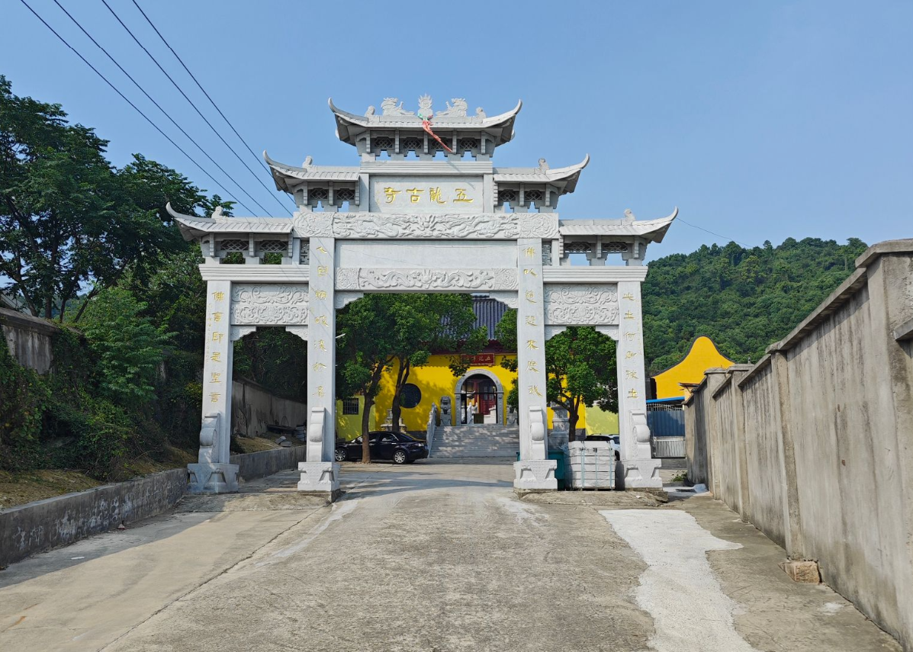
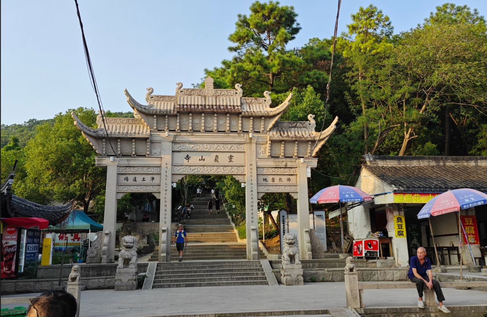
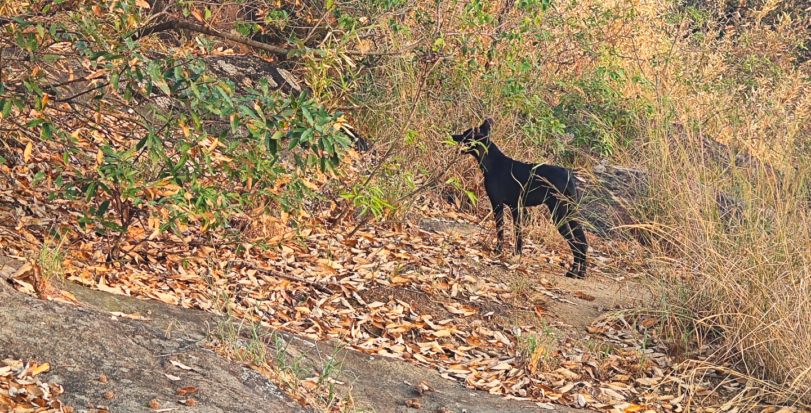
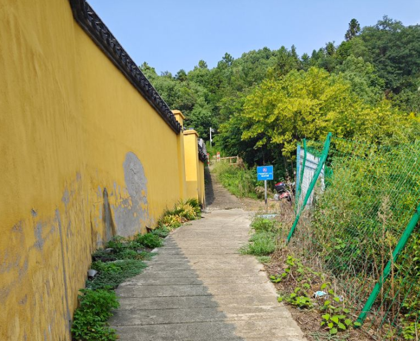
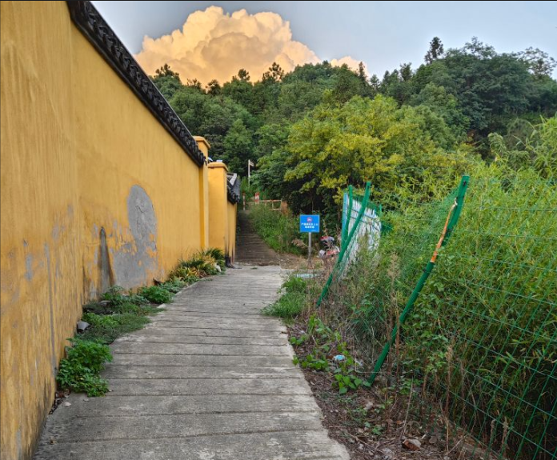
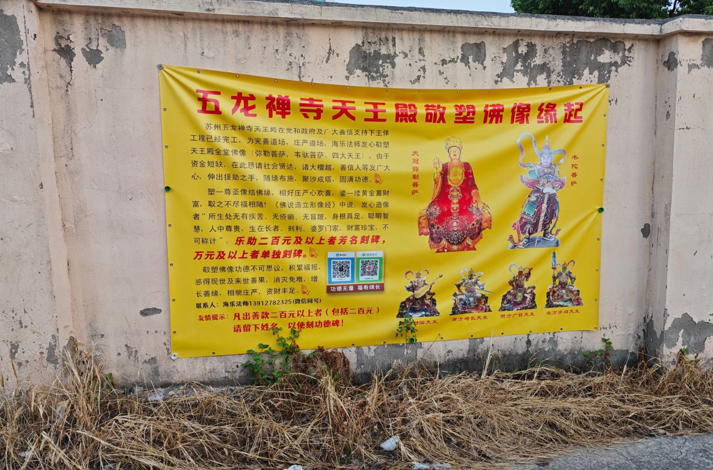
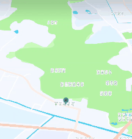

+++
date = '2025-09-08T20:51:25+08:00'
lastmod = '2025-09-08T20:51:25+08:00'
draft = false
title = '记爬灵岩山'
categories = ["生活","随笔"]
tags = ["生活","随笔"]
+++

## 序

我已经好长时间没有出门了，每天除了上下班就没干过其它的事情，天天躺在出租屋里，感觉人都要废了，所以决定出去逛一下。并且今天的天气还不错，虽然有大太阳，但是时不时会阴一下。

## 一上灵岩山

先说一下我这次的爬山目标，就是从灵岩山正门一直往上爬，翻过几座山，到对面的马路上，然后沿着马路绕回地铁站。大概有6,7公里吧（我不确定）。

在下午大概2点的时候我坐地铁去了灵岩山站，大概2点半就到灵岩山下了，这期间我还走了一段路，到灵岩山脚下的时候感觉有点热，有抬头看了一下上山的台阶，说实话，我有点怕了。根据我前几次爬灵岩山的经验，我感觉我走不完全程，只爬到灵岩山顶就下去又没什么意思，我想了想，算了吧，只上到灵岩山顶与这次目标不符，干脆直接不上。

我又想了一下，这次不能白来，就绕着灵岩山转一圈吧，顺便看看有没有什么好玩的地方，于是我就沿着公路往前走，走呀走，走呀走，一边看地图一边走，走着走着我发现一条小路，地图上显示好像也能通到山上。我就想从这条小路上去看看，实在不行就回去。起初我是不太敢上去的，因为这条小路里面有一个大门，门上有个牌匾，上面写着五龙古寺，我不太想进寺庙，我想着来都来了，就进去看看吧，真是没路就回去。

我往里面走了几步发现了有一条小路，不过要先经过这个大门，我就进去了，一直顺着这条小路走，走着走着我发现这好像真是上山的小道，然后我就继续往前走，走着走着就看见有人从山上下来，是大人带着娃来爬山了。这条道还是有点陡的，但不是太陡，由于太热的缘故吧，我觉得我快不行了，再加上我肚子突然有点儿疼，想找个五谷轮回之地，转了半天都没找到能下脚的地方，不过还算是老天有眼，我又走了几步，发现了一个福地，有个地方可以下去，而且下去之后还是比较平的，我有点小开心。然后.....,你懂的，不过经过一路上坡，然后停下来，一会儿就出了很多汗。后来经过五谷循环，舒畅了不少。我爬上去，站在一个路边把上衣脱了。实在是太热了，刚脱掉衣服，我就听见有人来的声音，我比较害羞，怕如果有女人看见我感觉不太好，但是如果现在穿上衣服会显得手忙脚乱，让他们看见以为我在干啥呢，这不好，所以我就没管他门。后来他们经过我的旁边，我看见来的是一个中年男女，还牵了一条小狗。这一路上我见了不少来爬山的人，我就想，这么热的天你们还出来爬上，而且现在你们是2,3点下山，说明你们1,2点，或者是12点就开始上山了，我感觉这有点逆天，更逆天的是有的人竟然还带着十岁左右的娃，而且不止一个娃，这正是一天最热的时候，我只能说确实牛逼，我还得练。

现在状态实在不太好，我就开始下山了 ，虽然还没上去。下山下了两步，我感觉我不行了，走不动了，必须休息一下，然后我就坐下了，休息了几十分钟，然后慢悠悠的下山了。

## 二上灵岩山

下山后，我沿着公路慢悠悠的原路返回，走了一会儿，我又到了灵岩山下，抬头一看，有不少的人还在上山，现在状态好点了，我感觉我现在又行了，爬到灵岩山顶还是没问题的，于是我就沿着台阶往上走。在路上，我看见一个大哥，30多了应该，身上的肉还是有点的，还抱个小娃娃，我心中暗想，这大哥厉害，牛逼。一路上没什么特别的，我就走呀走，走呀走，不到一会就到顶了。

然后继续往前走，走到一个山崖边看风景。就在这时，我发现了一只小黑狗儿，不是太大，也不是太小，和我一样，就是有点瘦。这只狗引发了我的疑问，它是怎么上来的？看它的表现，它在附近好像没有认识的人，奇怪。然后我又看了下地图，我擦，我刚才下山回去的地方就是在这附近，就没多远，于是我看着地图在这里转了一会儿，来来回回两三遍，终于找到了刚才我上山的那条路，原来，我刚才差点就爬上来了。找到路就回去吧，天也不早了，然后我就顺着路回去了。

下山的时候我想起我刚才在这里拍了一张照片，于是我又拍了一张。

|  |  |
| ------------------------------------------------------------ | ------------------------------------------------------------ |

另外，我再补充一点，这条小道在五龙古寺旁边，五龙古寺门口还贴了一个一张公告。我一看，善卷200就能芳名刻碑，厉害。

下山之后实在是有点累，于是我就打了个滴滴回去了，不过感觉这个滴滴司机态度不太好。

另外再附一个我的爬山轨迹图吧！

## 到家之后

累，实在是真有点累，感觉头里面好行有什么东西似的，还有点沉重，和我以前夏天从地里干完活回家休息时的感觉是差不多的，我感觉我有点被热到了,不过还好，没有被热坏，还能自己点外卖，自己吃饭，自己睡觉。
