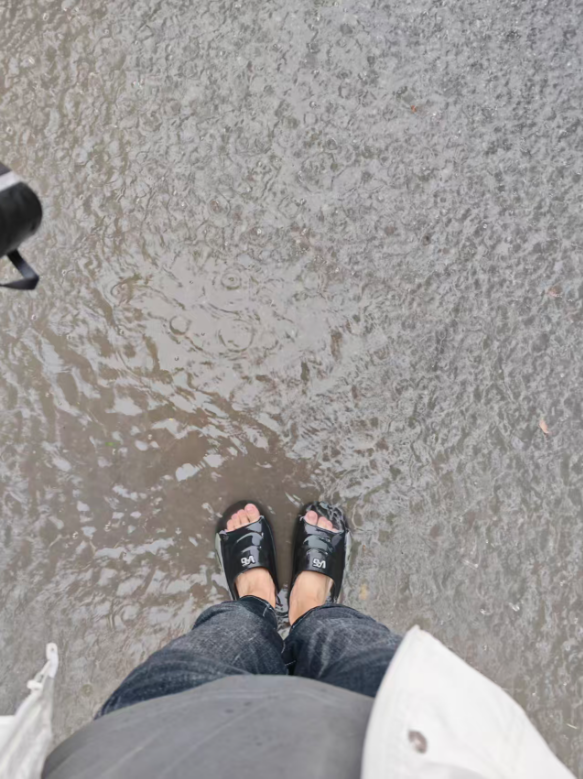

+++
date = '2025-09-30T20:14:14+08:00'
lastmod = '2025-09-30T20:14:14+08:00'
draft = false
title = '上班前怎么下大雨了？'
categories = ["随笔"]
tags = ["随笔"]
image = "static/image-20250930205149949.png"

+++

今天是2025年9月30日，明天是2025年10月01日，本来今天很开心，连起床都比平常早了几分钟。

我起床的时候还没有很大的雨，就一会儿，窗外的雨越来越大。相对来说我还是比较喜欢下雨天的，下雨天给我带来平静的感觉，并且下雨的时候我感觉环境很好，气氛也很好，如果是在炎热的夏天，还能给天气降降温，这简直是神的恩赐。就拿今天来说，在出门前我还沉浸在这种平静的氛围中，当我看向窗外的时候，雨在外面哗哗的下，整个天空还是雾蒙蒙的，时不时还有凉风吹来，让我感到心旷神怡。我此时还没有意识打事情的严重性。

当我下楼后，我懵逼了，这雨太大了，雨伞根本挡不住这么大的雨，打着雨伞推个车的功夫，裤子已经湿了半截，腿立马感到潮乎乎的，还有雨飘到身上。此时，我心里想的是，完了，电车是骑不成了，如果单手骑车，天还下着这么大的雨，还刮着大风，这样骑电动车上班是有点危险的。我怕了。不过此时我还没有慌，因为我今天起的比平时早一点，时间被我卡的死死的，如果打车去上班的话，时间是来的及的，这时我就打开手机准备打一个车去上班。我一边向小区门口走，一边打车，什么高德，滴滴，通通安排上。到小区门口，我站在一个超市的门口等车，等了一会，还没打到车，我仔细的看了一下手机，我尼玛，此时有一百多人在打车，刚才显示2-3分钟内可以打到车，这都几分钟了，还没打到，我看了一下时间，有点慌了。我此时没有别的办法，只能默默的等车。又等了一会，我坐不住了，我感觉打到车已经没有希望了，今天上班必定是会迟到的，我摸摸我干瘪的钱包，欲哭无泪。既然要迟到，这车，不打也罢。

这时，我打着我的雨伞，走向了去公司的路。不出所料，果然迟到了。不过幸好我有先见之明，穿的是拖鞋，如果穿的是什么小白鞋，现在的处境会更糟糕。并且没有打车去上班，省了十几块钱，今天的午饭有着落了。开心。

