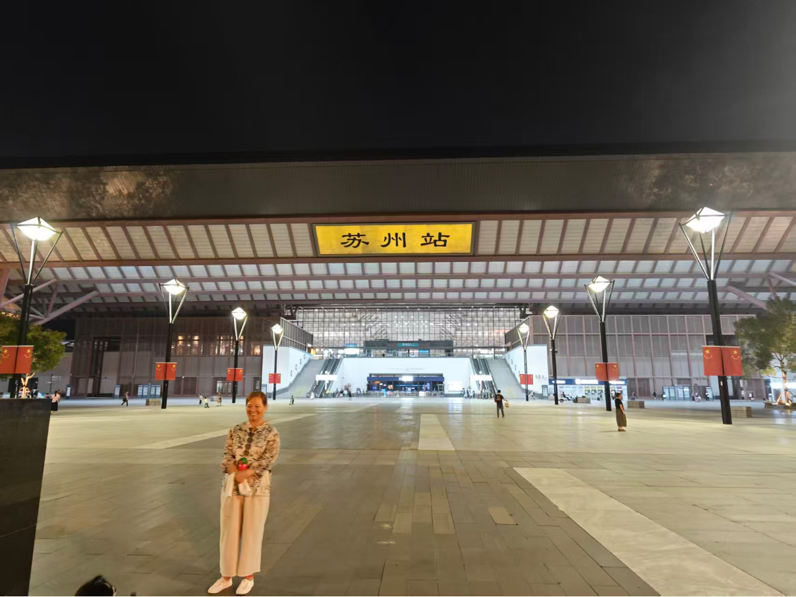

+++
date = '2025-10-11T23:15:50+08:00'
lastmod = '2025-10-12T02:41:50+08:00'
draft = false
title = '寻找苏州环古城河健身步道'
categories = ["随笔"]
tags = ["随笔"]
image = "苏州八门之平门.png"

+++

今天在摸鱼的时候，突然发现了一个我感兴趣的东西，[苏州环古城河步道](https://www.lipk.org/)，全长大概15km，正好今天是周六，我想着明天去玩一趟。然后我就查了一下资料，发现苏州环古城河步道是绕着苏州城走的，可以经过[苏州八大城门](https://baike.baidu.com/item/%E8%8B%8F%E5%B7%9E%E5%8F%A4%E5%9F%8E%E5%85%AB%E9%97%A8/5239420)，我一想，这八大城门如果是晚上看到话应该会开灯，到时候应该会很好看，我就想着等下周晚上来玩一下，等一下班就直接坐地铁去。我又想了一下，既然是下周星期的时候下班去，为什么不今天晚上就去呢？今天也刚好周六了，等下班了休息一下就坐地铁去吧，正好也可以先探一下路，我觉得可以。

下班后我就坐地铁去了，我大概看了一下地图，觉得从苏州站下地铁可以离我想去的目的地较近，我规划了去苏州站的路线。说实话，我来苏州站已经有几次了，竟然没有发现有城门就在苏州站附近，就在苏州站面前，有这么壮观的古城墙我竟然不知道（也难怪，我每次来都是从北广场进站的，连苏州站有南广场我都不知道，从来没有关注过）。

我的方向感是极差的，经常不知道东西南北，只知道前后左右。我到苏州站后我是不知道怎么走的，我一般喜欢等到出站了再看地图。我当时直接凭着感觉就来到了站前广场，苏州站北广场，在站前广场我没有发现有河，也没有发现有城门，只有两座高楼，有一座上面写着维也纳酒店的招牌，很高，很大，也很繁华，这是我每次来都能看到的景象。

我打开地图，地图显示要穿过苏州站才能看到河，才能到平门。地图上显示的路线我竟然没有找到，有时候看地图也挺烦的，地图上显示的路线我不知道是地下的路线还是地上的路线，或者是什么1F，2F路线，我找不到。我没办法，我就去了地下一层，就是刚才的地铁出站口，沿着反方向横穿苏州高铁站，我猜对了，我看到了有苏州南广场的指示牌，然后沿着指示牌到了苏州站南广场。一到南广场，我就看到了平门，确实很不错。这里有很多人在这里玩。

我补充一点：现在我终于知道苏州站到南北广场，也总算对苏州站有了一个宏观的认识，苏州站有2个广场，南广场和北广场。在北广场可以看到高楼大厦，在南广场可以看到苏州八门的平门。我再补充一点，苏州南广场还有一个人像，就在广场上，很容易就能找到。

然后我又搜了一下地图，顺着地图上的路线就到了河对面，走了一会儿，我来到了平门楼上。

我一直顺着护城河边的路走，路上有很多人，有钓鱼的大哥，有拍汉服照的小姐姐，有健身的老人，有抱着娃的年轻人，也有推着娃的年轻人，也有各种小学生，在这条道上，有的地方人多，也有的地方人少。

我又走了一会，发下有一座桥上有很多人，我也上去了，顺便拍了几张照片。哦，对了，这座桥叫五龙桥。

我又走了一会，好像是到了北码头，在里面发现了一张画，姑苏繁华图，很好看。说实话，这张图给我的感觉是苏州很繁华，很有生活气息。据说有12m多长，比清明上河图还长。

趴了壁虎的姑苏繁华图可遇不可求。

我又走了一会，从北码头出来了，走着走着走到一个人特别多的路口，有交警推着栅栏维护秩序，好熟悉的感觉，我转身一看，到山塘街了。我之前在这附近住过几天，进去这个门就能找到七里山塘街，免费的，里面还可以，在里面的一个桥上可以听到有家店里面唱戏，我不懂，好像是唱戏，还有小姐姐跳舞。

当我回头看到山塘街的这个大门的时候我瞬间晕了，就在一瞬间分不清了前后左右，把我从哪条路过来的都忘了，又转了一圈才找到来时的路，然后我就沿着来时的路多走了几步，你猜我看到了什么，我走到了阊门遗址，苏州八门之一。唉，在苏州的街上，多转头，就能发现眼前一亮的东西，沿着苏州环古城河健身步道，看见弯儿随便一拐，就是景点，就是遗址。

透过阊门向里面看，我看到了两排古风建筑，感觉还不少，本来想进去看一下的，我想了一下，还是没有进去。如此美景让我望而却步，我想让我对里面的美多保留一分幻想。或许在今天，我还不想解开你那神秘的面纱。

我当时还在想，进入阊门里面都是这种房子吗？我又想了一下，观前街好像也在里面，我之前有幸来过观前街，观前街不仅是高楼大厦异常繁华，观前街附近也是高楼林立，灯红酒绿。

我看了一下时间，不早了，正好我知道附近有一家张亮麻辣烫，去吃个饭吧，吃完饭后我就要做地铁回去了。

吃完饭后我又小转了一会，来到了石路地铁站，我抬头一看，是9号口，我不想从9号口进，我想找我熟悉的12号口，我想我永远也不会忘记12号口，即使我忘记了12号口，我也不会忘记12号口那些高楼，其中有一个高楼，上有招牌，绣娘丝绸。（没别的意思，我第一次来苏州找工作的时候，从火车站坐地铁来的就是时候从石路站12号口出来的，我一出来就看到宽阔冷清的街道，抬头看是高楼大厦，后来在这里待了几天除了山塘街我就记住了四个字，绣娘丝绸）

最后我坐上了回去的地铁，顺便拍张个照片。

今天就到这里吧，最后再分享几张照片吧，晚安。

