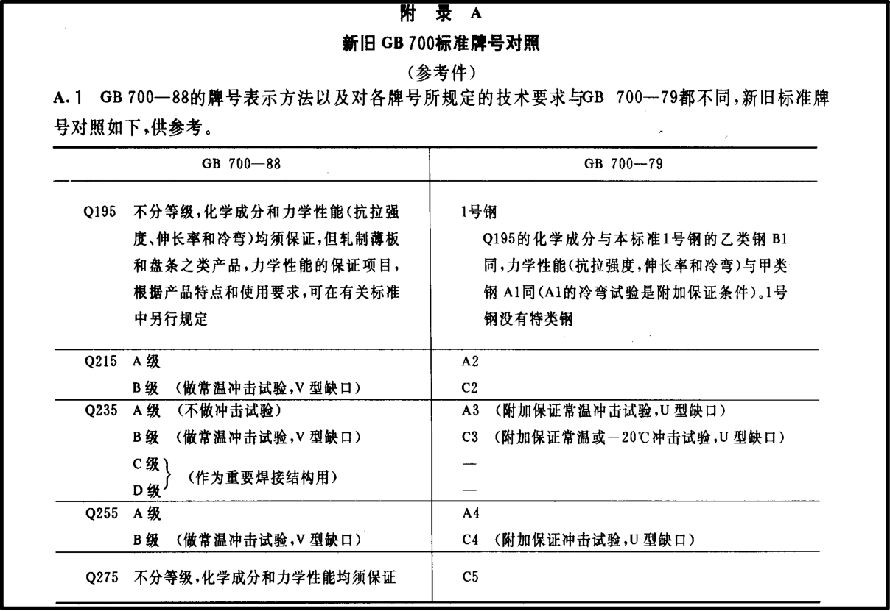

+++
date = '2025-11-13T22:53:49+08:00'
lastmod = '2025-11-13T22:53:49+08:00'
draft = false
title = '关于碳素结构钢牌号'
categories = ["机械工程"]
+++

在实际的工作中，关于碳素结构钢的牌号，可能会遇到A3钢这种类型牌号的叫法，这对于鄙人来说是既陌生又熟悉，说它陌生是因为他有点老，说熟悉它吧，鄙人又不喜欢这样称呼它，而且还有听到A3钢不是Q235A的说法，有时会听到A3板的叫法，鄙人更晕了，每每看到Q235A，鄙人就会发出疑问，Q235A到底是什么鬼？它到底是不是A3钢，它和A3板又是什么关系？偶然机会，鄙人看到了一篇文章[A3、A3F钢 | 碳素结构钢钢号](https://mp.weixin.qq.com/s/rZndgDJoR7jOFhxs7A-iqA)，遂查阅了一下资料，发现了其中的一些端倪。

1988年，国家标准发布了GB/T 700-1988，由《碳素结构钢》GB 700-88替代《普通碳素结构钢技术条件》GB 700-79，碳素结构钢的牌号出现了较大的变化，从此，碳素结构钢出现了Q195，，Q25A，Q235A，Q235B等牌号的表示方法，代替了A3钢等的碳素结构钢的牌号表示方法，现附GB/T 700-1988新旧GB700标准牌号对照以便对比，如下图。

参照此对照表来说，在碳素结构钢中，A3钢与A235确实有对应关系，但是有佬分析，A3钢与Q235A却不是完全相等的，它们还是有差别的，不能完全替换。经这样一分析，鄙人又懵逼了，到底A3钢和Q235到底是什么关系？

经鄙人深入思考，不必在纠结他到底是A3钢还是Q235A。现在市面上应该大部分是Q235A，A3钢在市面上应该是很难买到的，如果能买到A3钢，它应该比Q235A更贵，因为应该很少有企业造A3钢了吧，请看鄙人分析。

在1988年，A3钢这种牌号已经被废止了，碳素结构钢的叫法已经完全改变，由新的标准替代了，关于A3钢的制作标准已经被废了，由新标准替代了。什么意思？太子已经被废了，新王已经登基了，此时还叫太子，你想干什么？此时，企业若还大量生产A3钢，鄙人认为是不合适的。

其实不必纠结什么A3钢和Q235A是什么，其实它们的区别也不大，亦或是没有区别，按照规定，市面上应该是没有A3钢的。若使用A3钢，除非有特殊需求，但需清晰注明。

不过，还有一个问题，市面上存在的普通碳素结构钢到底是按1988年前的标准造的，还是1988年之后的标准造的那就不得而知了。

值得注意的是，在2007年2月1日，GB/T 700-1988又被GB/T 700-2006代替了，不过牌号的表达并未发生较大变化。现在是2025年，市面上的普通碳素结构钢是按GB/T 700-79的标准生产的，还是按GB/T 700-1988标准生产的，亦或是按GB/T 700-2006生产的，再或者是，哪个标准都没有按，是它们有自己的配方，那就不得而知了。

如果此时有朋友来问我说他不明白A3钢与Q235A的关系，我会告诉他，兄弟，大清已经亡了，世上再无A3钢。

以上内容为鄙人无聊时的分析，仅供参考。

参考文档：

[A3、A3F钢 | 碳素结构钢钢号](https://mp.weixin.qq.com/s/rZndgDJoR7jOFhxs7A-iqA)

[“A3钢”一律套成“Q235—A钢”易陷入多种“误区” ——谈GB700—88中有关材料的应用](https://www.cqvip.com/doc/journal/4001247603?sign=896e6d748a75a82b2b76f5846c50ae9679be914d29b129d9856a541f648dc87e&expireTime=1794576284344&resourceId=4001247603)