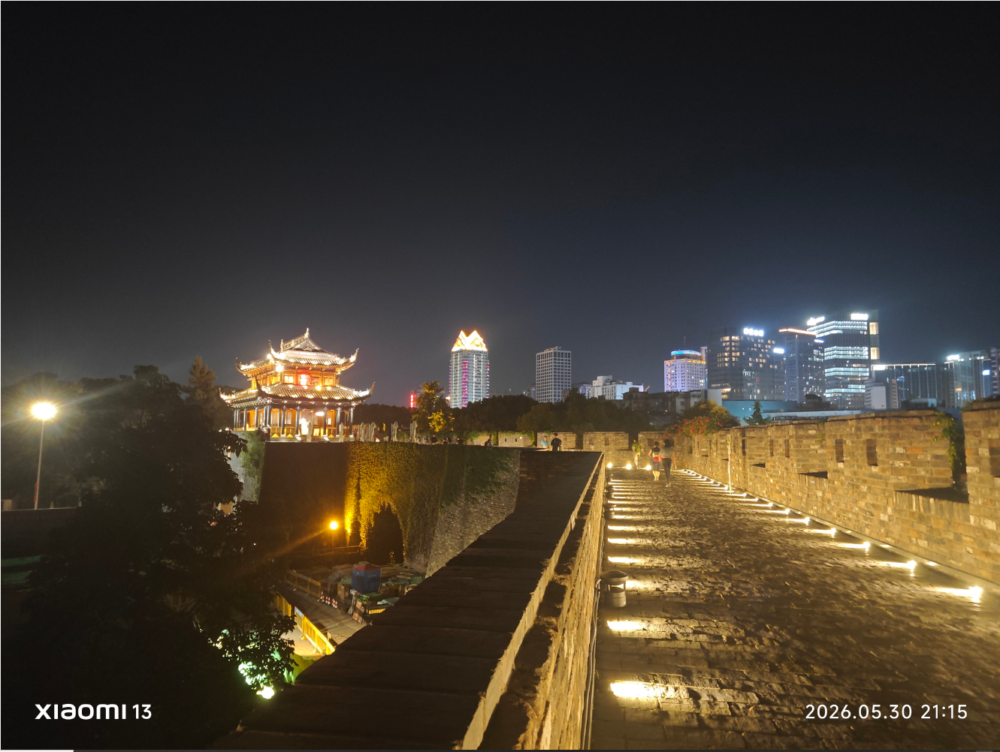
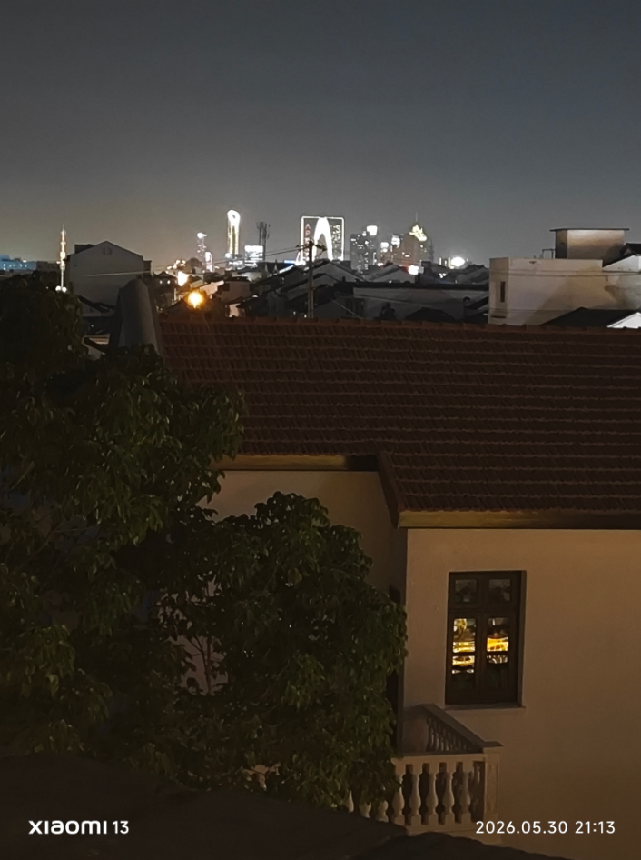
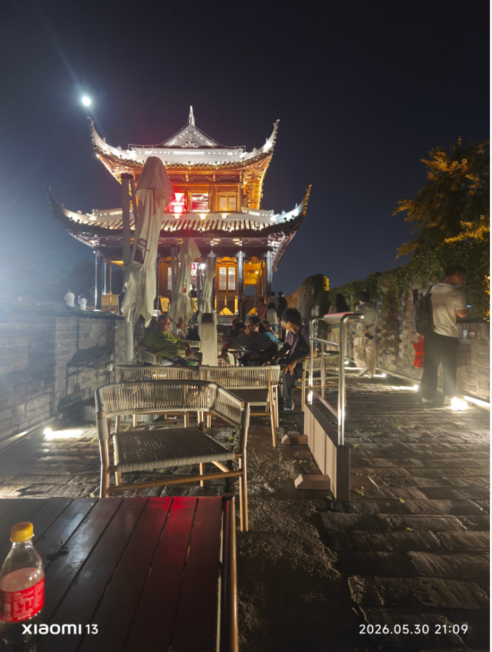
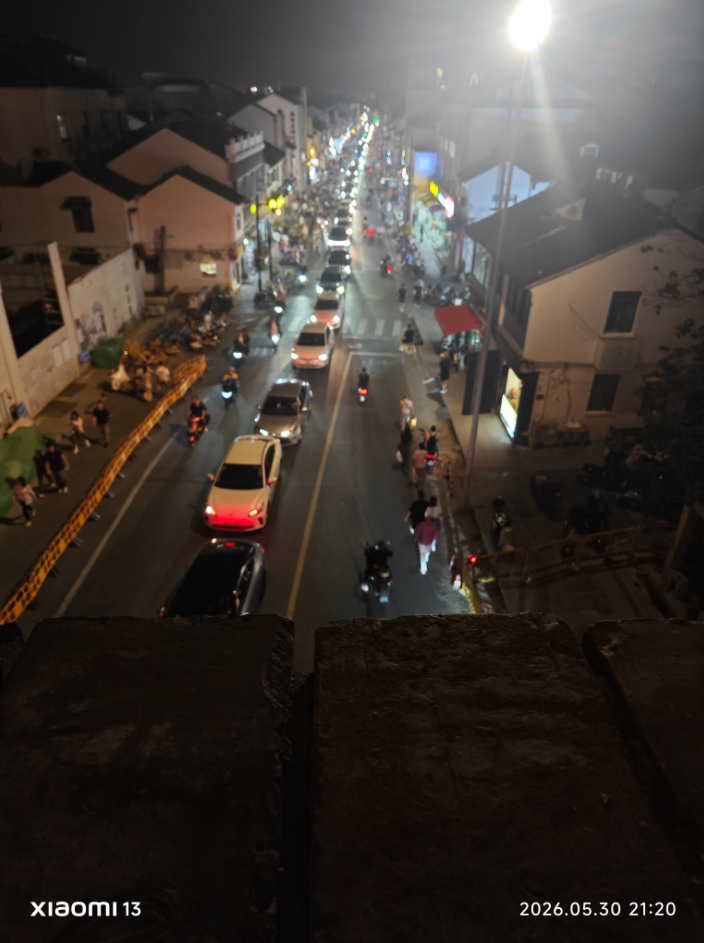

+++
date = '2026-05-31T12:48:03+08:00'
lastmod = '2026-05-31T12:48:03+08:00'
draft = false
title = '2026 05 30 晚上去了阊门附近'
categories = ["随笔","网站"]
tags = ["随笔"]
image = "static/static/image-20260531125607929-1780203391245-1.png"

+++

昨天晚上，闲着没事，我又去了山塘街，上阊门转了一圈，人真的很多。阊门上人不是很多，山塘街人很多，可能是人们只知道有山塘街，不知道有阊门吧。我在阊门上拍了几张照片，发现在阊门上可以看见东方之门。

看了一会下去了，然后去山塘街外面转了一圈。

白居易真的牛，但是现在他的一首诗都没想到，回去一搜，还真不少，这么多熟悉的时竟然都是白居易写的，现在附上一首吧。

离离原上草，一岁一枯荣。野火烧不尽，春风吹又生。远芳侵古道，晴翠接荒城。又送王孙去，萋萋满别情。——〔唐代〕白居易《赋得古原草送别》

然后我就回去了，不想坐地铁，就坐了公交，在回去的路上，有一段，公交突然冲上了一个拱形的路，我意识到这应该是一座大桥，我打开地图一看，这座桥是架在京杭大运河上的，心中不禁感叹。